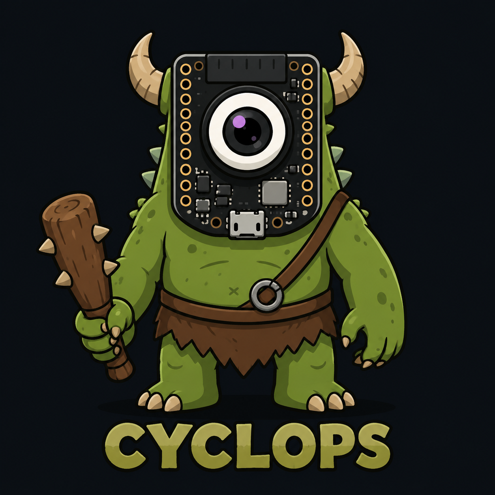
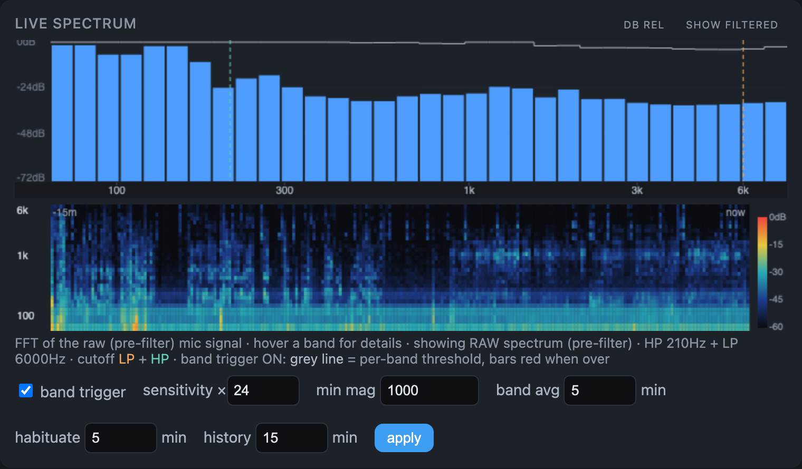
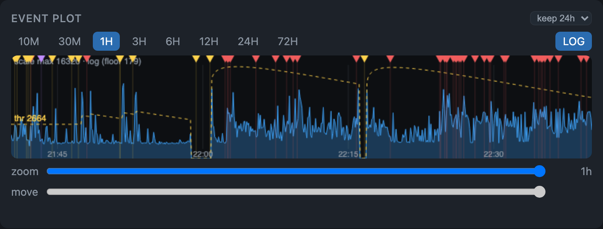
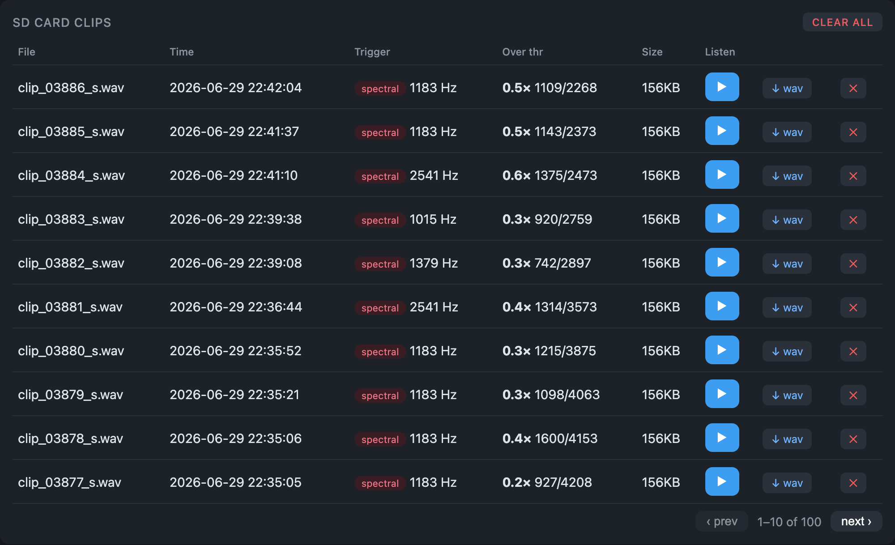
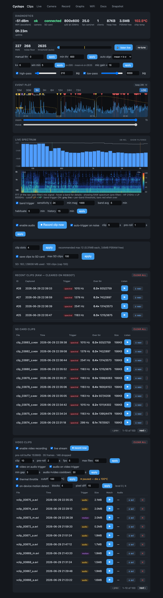

<p align="center">
  
</p>

# Cyclops — ESP32 MJPEG camera with audio/video clip capture

Multi-client MJPEG streaming server for ESP32 camera boards. One assembled
JPEG chunk is fanned out to every connected viewer per frame, with a small
PSRAM buffer pool so capture and delivery overlap. The XIAO build adds a PDM
microphone with live in-browser audio monitoring, adaptive audio-clip capture
to SD/PSRAM, and motion/audio-triggered MJPEG-AVI video clips.

## The dashboard

Everything is driven from one dark-themed web dashboard served straight off the
device — no app, no cloud.

<p align="center">
  
</p>

*Live FFT spectrum and a scrolling spectrogram, with adjustable per-band sound triggers.*

<p align="center">
  
</p>

*The Event plot: a level/threshold timeline with source-colored event markers, zoomable from 10 minutes to 72 hours. The same component plots audio level on the XIAO and motion on the ESP32-CAM.*

<p align="center">
  
</p>

*Recorded clips on the SD card — play or download inline, each tagged with the trigger that fired it.*

<details>
  <summary>See the whole dashboard on one page</summary>
  <p align="center">
    
  </p>
</details>

## The Absolute Quickest Start

1. **Flash:** `pio run -e seeed_xiao_esp32s3 -t upload` (XIAO over USB; use `-e esp32cam` for the AI-Thinker board).
2. **Join its Wi-Fi:** the device raises an access point named **`Cyclops`** — password **`cyclops1234`**.
3. **Add your network:** open **`http://192.168.8.1/wifi`** (no login by default), scan, and join your own Wi-Fi.
4. **Use it:** rejoin your own Wi-Fi and open **`http://cyclops.local`** — live stream, audio, clips, and settings are all on the dashboard.

To skip steps 2–3, pre-seed your home Wi-Fi in `src/wifikeys.h` before flashing (see
[First-time setup](#first-time-setup)). The device ships **passwordless** — **set a
web-login password** at `/wifi` before putting it on a shared network.

## Hardware / build targets

| Env | Board | Features |
|---|---|---|
| `seeed_xiao_esp32s3` (default) | Seeed XIAO ESP32S3 Sense | MJPEG stream, camera settings, WiFi portal, **motion detection + Event plot, audio clips, video clips, continuous recording** |
| `esp32cam` | AI-Thinker ESP32-CAM | MJPEG stream, camera settings, WiFi portal, **motion detection + Event plot**, Graphs/diagnostics (no audio; no SD in this firmware, so no clip saving/recording) |

Board capabilities are gated by `HAS_AUDIO` / `HAS_SD` in `src/capabilities.h`.
**Motion detection runs on every board** (off the PSRAM frame ring, no SD), and
both boards render the **same `EventPlot`** (shared `/ui.js`): the XIAO plots
audio level + triggers, the ESP32-CAM plots motion + motion events. Audio and
SD-backed clip storage remain XIAO-only.

## First-time setup

The home WiFi credentials live in `src/wifikeys.h`, which is **git-ignored**
(it holds your WiFi PSK — never commit it). The file is **optional**: with it
present, that network is seeded into NVS on first boot and keeps the static IP;
without it, the device boots straight to the `Cyclops` AP so you can add a
network at `/wifi`. To use it, copy the template and fill it in before building:

```sh
cp src/wifikeys.h.example src/wifikeys.h   # then edit in your SSID/PSK
```

```cpp
#include <Arduino.h>
// WiFi credentials for the initial/home network (more can be added at /wifi).
const char* ssid     = "YOUR_WIFI_SSID";
const char* password = "YOUR_WIFI_PASSWORD";
```

The web UI ships **passwordless** — out of the box there is no login prompt and
anyone on the network has full control. Set a web-login password at `/wifi`
("Web login": username + password) to turn on HTTP Digest auth; the credentials
persist in NVS and you can turn auth back off there too. **Set a password before
putting the device on any shared network.** To ship a build that requires login
from first boot, define a non-empty `DEVICE_DEFAULT_PASS` in `src/branding.h`
(or `branding_local.h`).

## Build & flash

```sh
pio run                                  # build default (XIAO)
pio run -e esp32cam                       # build AI-Thinker
pio run -e seeed_xiao_esp32s3 -t upload   # flash over USB
```

The XIAO uploads at 921600 baud; opening the serial port toggles DTR and
resets the board. After the one-time USB flash that installs the OTA partition
table (see below), subsequent updates can go **over the air** — no cable.

## Over-the-air updates (OTA)

Firmware can be updated wirelessly. Two paths share one `Update.h` flash-write
core (`src/ota_update.{h,cpp}`):

- **Dev push (ArduinoOTA / espota):** push a build straight from PlatformIO.
- **Dashboard / fleet (HTTP `POST /update`):** upload a `firmware.bin` from the
  **Firmware** card on the `/wifi` page (or `curl`), gated by the same digest auth
  as every other endpoint. The device reboots into the new image (~15 s).

```sh
export OTA_PASS='<the OTA password>'                  # = DEVICE_AP_PASS by default
pio run -e seeed_xiao_esp32s3_ota -t upload           # push to cyclops.local
pio run -e seeed_xiao_esp32s3_ota -t upload \
    --upload-port 192.168.4.65                        # ...or target a device by IP
```

**One-time bootstrap (required).** OTA needs two app slots, so the build uses a
custom dual-OTA partition table — `partitions_xiao_8mb_ota.csv` (2×3 MB) and
`partitions_cam_4mb_ota.csv` (2×~2 MB), set via `board_build.partitions`. A
partition-table change **cannot install itself over the air**, so each device
needs *one* final USB flash to lay it down; every update after that is wireless.
The `nvs` partition keeps its offset, so **WiFi credentials, the mDNS hostname,
and all saved settings survive** that re-flash. (SPIFFS is dropped — it was
unused; `<FS.h>` is only pulled in for the SD `File` type.)

**Notes.**
- The OTA password is the compiled `OTA_PASSWORD`, defaulting to `DEVICE_AP_PASS`
  (from `wifikeys.h`). espota envs read it from the `OTA_PASS` env var via
  `--auth=${sysenv.OTA_PASS}`. Override with `-DOTA_PASSWORD=...` if you want a
  distinct secret.
- Target espota by IP when a device's mDNS hostname isn't `cyclops` (the per-device
  fleet name), or when mDNS isn't resolving from your machine.
- `GET /diag` returns `"fw"` (= `FW_VERSION`, default `__DATE__ " " __TIME__`) so
  you can confirm an update actually landed; the Firmware card shows it live.
- During the flash write the camera/audio/video tasks idle (`otaActive()`), so the
  live stream stalls briefly. A bad image only lands in the *inactive* slot.

## Tests & architecture

The tricky decision logic is being pulled out of the hardware-coupled `.cpp`
files into **pure, header-only "functional core" modules** (no Arduino / ESP /
FreeRTOS includes) that run — and are unit-tested — on the host:

```sh
pio test -e native     # runs all host unit tests, no board needed (~seconds)
```

Pure cores extracted so far, each with a `test/test_<name>/` suite:

| Header | Responsibility |
|---|---|
| `src/audio_dsp.h` | adaptive trigger threshold + noise-floor estimator |
| `src/wav.h` | WAV/PCM header bytes |
| `src/retention.h` | continuous-recording eviction policy (minutes + MB caps) |
| `src/http_parse.h` | Digest `key=value` + cookie/token parsing (auth) |
| `src/history.h` | plot-history max-pool decimation (ring wraparound) |
| `src/avi.h` | MJPEG-AVI header / frame-chunk / index byte framing |
| `src/motion.h` | frame-diff motion analysis (block deltas, masking, bitmap) |
| `src/sd_health.h` | SD mount/recovery policy (probe cadence, exponential backoff) |
| `src/path_safe.h` | clip-name path-traversal guard for `/sd/file` & `/sd/delete` |
| `src/ratelimit.h` | cooldown check (audio→video cross-trigger throttle) |
| `src/metrics.h` | diagnostics time-series metric set + float↔uint16 encoding (`/graphs`) |
| `src/presence.h` | connected-client tracking (distinct IPs active within a time window) |
| `src/thermal.h` | thermal-governor hysteresis (pause/resume the PSRAM-heavy video load by die temp) |

The pattern: a pure header is the single source of truth and is included by both
the firmware (the thin "imperative shell" in the `.cpp`) and the host tests. Add
logic in the header, pin it in `test/`, and `pio test -e native` proves it before
it ever touches a board. The `native` env in `platformio.ini` only compiles the
test files + the pure headers — the hardware `src/` is never dragged into the
host build.

## Networking

- Joins the strongest saved network on boot; static/mDNS as configured.
- If no known network is reachable (or standalone mode is set), a fallback
  access point **Cyclops** comes up so the device stays reachable.
- Manage networks at `/wifi` (scan, add, forget, join, standalone toggle).
- The `/wifi` page also has device settings: the **device name** (mDNS host),
  a fully configurable **static IP** (address / netmask / gateway / DNS, or DHCP),
  the hotspot password, and the web-login credentials.
- mDNS: the device answers at `<name>.local` (default `cyclops.local`). The name
  is **runtime-configurable per device** at `/wifi` and persists in NVS, so a
  fleet flashed from one identical binary can each get a unique hostname (e.g.
  `cyclops-front.local`) — change it and the device re-announces immediately, no
  reboot. Give each unit a unique name to avoid `.local` collisions (and a unique
  static IP if you pin them).

### Factory reset (forgotten password recovery)

Once you set a web password, every endpoint is behind digest auth, so a
forgotten password locks you out of the whole UI. To recover (XIAO only),
**hold the BOOT button for ~5 seconds** while the device is running. That wipes
all saved networks, the AP/web credentials, and the static-IP setting back to
defaults **and erases the SD card clips**, then reboots onto the `Cyclops` AP
passwordless (no login). (Holding BOOT during a reset enters the bootloader instead — this only
fires from a long-press on a running device.) Camera/audio/video tuning is left
intact.

The display name, AP SSID, mDNS host, and fallback-AP password all come from
`src/branding.h` (`DEVICE_NAME` / `DEVICE_HOST` / `DEVICE_AP_PASS`). To rebrand a
build without touching tracked files, add a git-ignored `src/branding_local.h`
that `#define`s any of them; otherwise the `Cyclops` defaults apply.

## Endpoints

All endpoints require HTTP Digest auth.

| Path | Purpose |
|---|---|
| `/` , `/audio` | Dashboard (live stream + audio listen, clips, audio levels, settings) |
| `/live` | Bare live view |
| `/mjpeg/1` | MJPEG multipart stream |
| `/jpg` | Single JPEG capture |
| `/diag` | JSON diagnostics (rssi, heap, psram, fps, temp, SD state/drops, SD mount clock `sd_mhz`, …) |
| `/diag.log` | Download the SD-card log mirror (`/diag.log` on the card, when mounted) |
| `/graphs` | Diagnostics graph page: multi-metric history plot (see Diagnostics) |
| `/metrics/meta`, `/metrics/series` | JSON metric table + decimated history feeding `/graphs` |
| `/log` | Plain-text event log (`?clear` to wipe) — see Diagnostics below |
| `/camera`, `/camera/status`, `/camera/config`, `/camera/reset` | Sensor settings (`/camera/reset` clears saved overrides and re-applies the project defaults — a soft re-apply, not a driver deinit/init) |
| `/camera/power?on=0\|1` | Master live-stream switch (audio-only mode; off parks the camera to run cooler) |
| `/camera/probe` | Camera fault isolation: sensor id over SCCB + whether the DVP data bus has ever delivered a frame (control-bus vs data-bus faults) |
| `/wifi`, `/wifi/*` | WiFi portal (incl. `/wifi/cfg`: device name/mDNS host, static IP config, hotspot password, web login) and the **Firmware** (OTA) card |
| `/update` (POST) | Over-the-air firmware upload (multipart `firmware.bin`); reboots into the new image. See [OTA](#over-the-air-updates-ota) |
| `/audio/trigger`, `/audio/clip`, `/audio/clips`, `/audio/status`, `/audio/config`, `/audio/retune` | Audio clip capture & tuning (XIAO) |
| `/audio/stream`, `/audio/player.js`, `/audio/history`, `/audio/events` | Live audio listen (WebAudio PCM player), level-plot history, recent trigger events (XIAO) |
| `/sd/list`, `/sd/file`, `/sd/delete`, `/sd/clear`, `/sd/remount` | SD clip files (XIAO) |
| `/video/status`, `/video/config`, `/video/motion`, `/video/motion/history`, `/video/motion/events` | Motion detection + Event-plot timeline/markers (**all boards**) |
| `/video/trigger`, `/video/list`, `/video/clear` | Video clip capture (needs SD; XIAO) |
| `/ui.js`, `/caps` | Shared front-end (EventPlot + nav) and board capability flags (all boards) |
| `/rec`, `/rec/status`, `/rec/config`, `/rec/clear` | Continuous (loop) recording (XIAO) |

> **Live audio listen:** the dashboard's listen button plays the mic in-browser over
> WebAudio (`/audio/stream` serves raw 16 kHz/16-bit PCM). It buffers ~2.5 s ahead so
> multi-second TCP stalls on a slow or remote link stay inaudible — so expect a
> matching ~2.5 s delay on the feed (the device's small lwIP TCP window makes WAN
> delivery bursty, which the buffer smooths over).

## Diagnostics & logs

`GET /graphs` is a dedicated diagnostics page that plots the device's history as
a multi-line time-series: temperature, WiFi RSSI, camera/stream FPS, free
heap/PSRAM, connected clients, audio level, motion blocks, and event counts
(audio/video triggers, camera stalls, SD drops). "Connected clients" counts
distinct client IPs that made an authenticated request in the last 30 s — i.e.
people actively using the device — not the old MJPEG send-queue depth. The sampler folds one bucket of every metric
into per-metric PSRAM rings (~37 KB total, 1440 fixed buckets). The **retention
window is tunable** from the `/graphs` page (`/metrics/config?win_min=`, NVS-backed,
2 h–24 h): the bucket duration stretches the fixed buckets over the chosen span,
so memory stays constant and a longer window just means coarser resolution
(default 2 h → 5 s buckets). The amplitude-level plot on `/audio` has the same
knob (6 h–72 h over its own fixed ring). Each
series is **normalized to its own min/max** over the visible window, so any
combination overlays cleanly on one plot regardless of scale; click a metric in
the legend to toggle it, hover for real values. The underlying JSON
(`/metrics/meta`, `/metrics/series`) is available for external tooling.

`GET /log` returns a plain-text event log for diagnosing field problems
(hangs, SD dropouts, WiFi/IP issues) without a serial cable. It has two
backings:

- **RTC RAM ring** — a small fixed ring in `RTC_NOINIT` memory that **survives
  watchdog resets, panics, and software reboots** (lost only on a full
  power-cut). The first line of every session records *why* the device last
  reset (`power-on`, `sw-restart`, `TASK-watchdog`, `PANIC/crash`,
  `BROWNOUT`, …) plus the boot count — so if the device reboots itself you can
  pull `/log` and see what led up to it.
- **SD mirror** — when an SD card is mounted, entries are also appended to
  `/diag.log` on the card (truncated/reset at 256 KB — history discarded, not
  rotated) so recent history survives power loss.
  Written only from the SD writer task, never an HTTP request.

Logged events include boot/reset reason, WiFi connect (with the assigned IP and
whether the **static IP** was applied or it fell back to DHCP), SD mount/drop/
remount, low-heap warnings, and a 5-minute heartbeat. `GET /log?clear` wipes the
ring.

> **Static IP note:** static IP is configured at `/wifi` (address / netmask /
> gateway / DNS). When enabled it applies to whatever network the device joins;
> when off, the device uses DHCP. A pre-seeded `src/wifikeys.h` only supplies the
> initial network credentials — the IP comes from this setting, not that file.

## Security model

This is a **LAN device**. Understand the boundary:

- **It ships passwordless.** By default there is no login — anyone who can reach
  the device has full control, including firmware updates over HTTP. Set a
  web-login password at `/wifi` before putting it on any network you don't fully
  trust. Everything below applies once a password is set.
- **Transport is plain HTTP.** Digest auth keeps the password off the wire,
  but the video stream and all data are unencrypted. TLS is impractical for
  MJPEG on this hardware — put the camera on a trusted/IoT VLAN rather than
  exposing it to the internet or an untrusted network.
- **Digest auth has no replay protection or brute-force lockout.** The nonce
  count (`nc`) is not tracked across requests; a captured `Authorization`
  header can be replayed within the nonce TTL (12h). Stateless `nc` tracking
  was deliberately omitted because it breaks multi-client / parallel-request
  auth and the benefit is marginal on a trusted LAN. Use a strong web password
  and don't expose the device publicly.
- **Remember-me session cookie.** A successful digest login sets a signed,
  stateless cookie (`cyc_auth`, 30-day Max-Age) so browsers stop re-prompting -
  necessary on iOS, where WebKit doesn't persist digest credentials. The cookie
  is a bearer token over plain HTTP (same LAN-only threat model as digest) and
  is signed with a secret derived from the username+password, so changing
  either instantly invalidates every outstanding session.
- **OTA shares the same trust boundary.** HTTP `POST /update` is digest-gated like
  everything else; ArduinoOTA/espota is protected by the `OTA_PASSWORD` (MD5, defaults
  to `DEVICE_AP_PASS`). Both are LAN-only — a captured credential on this network can
  push firmware, so keep the device off untrusted networks and use a strong password.
- Never port-forward this device. Never commit `src/wifikeys.h`.

## Documentation

Deeper reference docs live in [`docs/`](docs/): [Architecture](docs/ARCHITECTURE.md),
[Hardware & Build](docs/HARDWARE.md), [HTTP API](docs/API.md), and
[Configuration & Operation](docs/CONFIGURATION.md).

## Contributing

Issues and pull requests are welcome — see [CONTRIBUTING.md](CONTRIBUTING.md)
for setup, the host test suite (`pio test -e native`), and PR guidelines.

## License

Copyright (C) 2026 Carmelo

Cyclops is free software: you can redistribute it and/or modify it under the
terms of the **GNU General Public License v3.0** as published by the Free
Software Foundation. It is distributed WITHOUT ANY WARRANTY. See the
[LICENSE](LICENSE) file for the full text.
